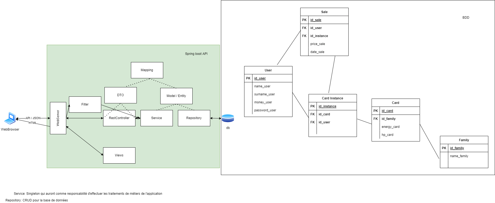

# asi-card-trading
## Architecture

## Lancement du docker postgres

newgrp docker
docker run --name pg-asi -p 5432:5432 -e POSTGRES_PASSWORD=pwd -e POSTGRES_DB=bd -e POSTGRES_USER=login -d postgres:14-alpine
